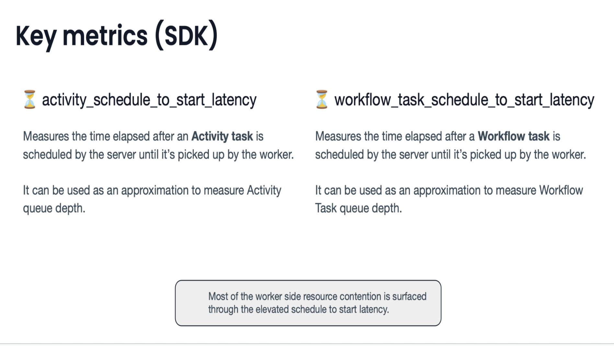
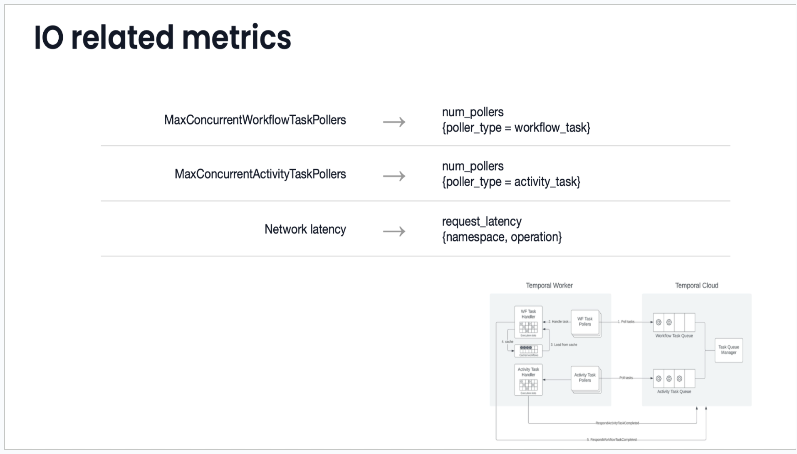
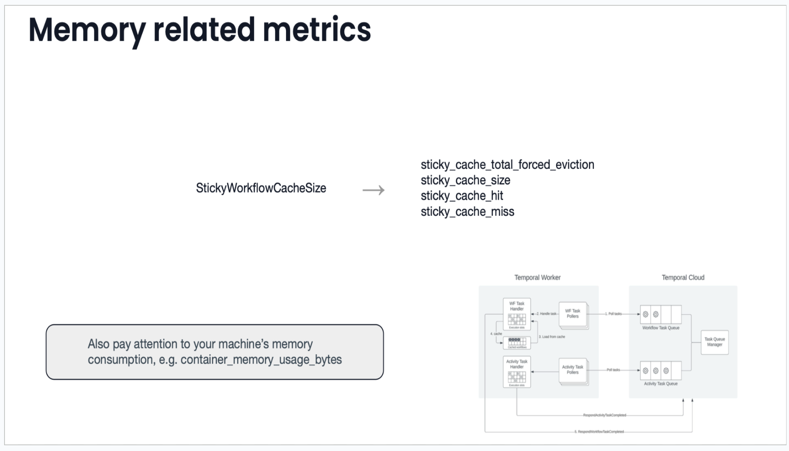
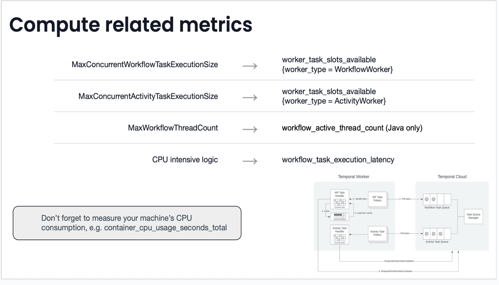
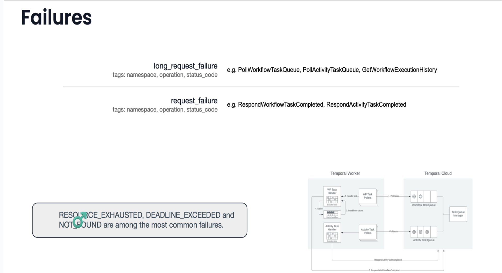

### Terminology

Workflow: A durable orchestrator to execute the flow of business logic. It manage the sequencing of activities and timers while ensuring state persistence and reliability.
Activity: A unit of work executed outside workflow, often involving external services or non deterministic tasks. Activities are invoked by workflows.
Workflow Task: A decision making task generated by Temporal for the workflow. It updates the workflow state and logic execution
Activity Task: A task created to execute an Activity
Queue: A durable task queue used by Temporal to manage tasks. Workflow and Activities tasks are enqueued enabling reliable execution even in the case of failures.
Workflow Task Queue: Internal queue for workflow task
Activity Task Queue: Internal queue for activity task
Sticky Queue: A dedicated workflow task queue for the worker. Created after the successful execution of first workflow task.

### Workflow Task Execution and Task Timeout

Default Timeout
The default timeout for a workflow is 10 seconds
Task Rescheduling
If a workflow task is timed out, the temporal server reschedules it on Workflow Task queue
Some worker then picks up the task
Execution Process
The worker retrieves the Workflow history events from the Tempoal server
Worker stores history in-memory in sticky cache and starts replaying the event history
Replay ensure workflow execution is resumable, reliable and durable
Worker executes the task and responds with success to the Temporal Server
Sticky queue creation
Temporal server creates a sticky queue, a dedicated queue for the worker to listen on
Sticky queue leverages sticky queue on the workflow worker improving the performance by reducing the redundant history replay

### Code Walkthrough

Read some records from DB, Let’s call it loan records - DB.get()
Process each one of them with following steps
Call a REST API - RestCall.call()
Call ValidateLoanActivity, Lets call it - activityA.taskA()
Call ProcessLoanActivity, Lets call it - activityB.taskB()
Call DisburseLoanActivity, Lets call it - activityC.taskC()
Save it processed loan in DB - DB.saveOrUpdate()

```java
// Example incorrect workflow impl.
public class LongRunningWorkflowImpl implements LongRunningWorkflow {
    ActivityOptions activityOptions = ActivityOptions.newBuilder().setStartToCloseTimeout(Duration.ofSeconds(2)).setRetryOptions(RetryOptions.newBuilder().setInitialInterval(Duration.ofSeconds(2)).setMaximumAttempts(3).build()).build();

    private final ActivityA activityA = Workflow.newActivityStub(ActivityA.class, activityOptions);
    private final ActivityB activityB = Workflow.newActivityStub(ActivityB.class, activityOptions);
    private final ActivityC activityC = Workflow.newActivityStub(ActivityC.class, activityOptions);

    @Override
    public void execute(String name) {
        List<Records> records = DB.get(name);
        List<Records> result = new ArrayList();

        records.forEach(r -> {
            RestCall.call("hello", name);
            String resultA = activityA.taskA("hello", name);
            result.add(new Record(resultA));
            String resultB = activityB.taskB("hello", name);
            result.add(new Record(resultB));
            String resultC = activityC.taskC("hello", name);
            result.add(new Record(resultC));
        });

        DB.saveOrUpdate(result);
        return records;
    }
}
```

### Workflow task timing out: What can go wrong

Timed out task != Task is killed. It may still be in progress on the worker.

1. Workflow execute a DB call and it blocks for unusually longer duration > 10 sec
2. Workflow gets timed out and is rescheduled again.
3. Another slot on the same or other worker re-starts the execution
4. It blocks on the same DB call and times out again.
5. A spiral sets in, In executing and re-executing Step 2 to Step 5
6. Soon there is no more available slots and workflow task is blocked and No progress is made

Pitfall: Task stuck in blocking call with no logs
There is nothing in the log as task has not failed yet and is still waiting on the blocking call.

#### Scenario-2: DB/REST call failed with some intermittent error

- Lets say, DB call has failed for some intermittent error
- Workflow is showing failed in the workflow history
- Remember, Workflow must be deterministic.On replay, it will just replay the exception from event history and again fail the workflow
- workflow won't make any progress or even retried.
- The workflow will be stuck

Misconception

- Workflow code will be retried again and intermittent error will recover in future retries

### Guideline & Solution

- Business logic in workflow is an antipattern
- Business logic must be in Activity
- Workflow code must be only doing orchestration of activities.
- Keep the workflow history size to a reasonable limits. Larger history size incur significant monetary cost, is memory intensive on Sticky cache and slow while replaying of workflow history events.

#### Approach - 1

- Make all the calls going out of workflow execution context, a part of Activity
- Activities by definition are retriable on errors. So if it fails for an intermittent error, it will get retried
- What works in the new Solution:
  - Intermittent failure are retried. No business logic in workflow.

```java
// Approach 1, move to activities
public class LongRunningWorkflowImpl implements LongRunningWorkflow {
    ActivityOptions activityOptions = ActivityOptions.newBuilder().setStartToCloseTimeout(Duration.ofSeconds(2)).setRetryOptions(RetryOptions.newBuilder().setInitialInterval(Duration.ofSeconds(2)).setMaximumAttempts(3).build()).build();

    private final ActivityA activityA = Workflow.newActivityStub(ActivityA.class, activityOptions);
    private final ActivityB activityB = Workflow.newActivityStub(ActivityB.class, activityOptions);
    private final ActivityC activityC = Workflow.newActivityStub(ActivityC.class, activityOptions);
    private final DbActivity dbActivity = Workflow.newActivityStub(DbActivity.class, activityOptions);
    private final RestActivity restActivity = Workflow.newActivityStub(RestActivity.class,)

    @Override
    public void execute(String name) {
        List<Records> records = DB.get(name);
        List<Records> result = new ArrayList();

        records.forEach(r -> {
            restActivity.call("hello", name);
            String resultA = activityA.taskA("hello", name);
            result.add(new Record(resultA));
            String resultB = activityB.taskB("hello", name);
            result.add(new Record(resultB));
            String resultC = activityC.taskC("hello", name);
            result.add(new Record(resultC));
        });

        dbActivity.saveOrUpdate(result);
        return records;
    }
}
```

### Problem With Approach 1

- Does not address the core issue of blocking DB calls and timing out
- Shifts the problem from Workflow task timeout to Activity task timeout (startToClose)
- DB calls in activities can still block for an unusually long duration.
- Activity gets timed out and is rescheduled again on the Temporal Server.
- Previously timed-out activities are never terminated; they remain blocked on DB calls. and keep occupying the slot
- Rescheduled activity occupy another worker slot. it again timeout.
- A repeated timeouts and reschedules lead to a cycle of execution and re-execution from Step 3 to Step 5
- Soon all workers slots for activity task is blocked and No progress is made

Pitfall: Task stuck in blocking call with no logs
There is nothing in the log as task has not failed yet. It is still executing and waiting on a blocking call. Let's say call return after the timeout, this activity will go ahead and execute the remaining method body.

### Problem with Retrying Timed out Task

- Task Timeout != Task killed
- It keeps running and occupying the worker slot indefinitely
- 3 retries can potentially put system in 3X load

### Approach 2 - Prevent Activity Timeout

- Get activity startToClose timeout in activity code.
- Fail the activity before it times out.

```java
@Override
public void doA() {
    Duration startToCloseTimeout = Activity.getExecutionContext().getInfo().getStartToCloseTimeout();

    RequestConfig request = RequestConfig.custom()
            .setConnectTimeout(startToCloseTimeout.minusSeconds(1).toSecondsPart()).build();

    HttpClient httpClient = HttpClientBuilder.create().setDefaultRequestConfig(requestConfig).build();
    try {
        // Make the HTTP request
        httpClient.execute(request)
    } catch (Exception e) {
        // fail the activity before start to close timeout
        throw ApplicationFailure.newFailure("connection timed out: ", e.getMessage());
    }
}

// DB Activity timeout solution
public DbActivityImpl implements DbActivity {

    @Override
    public void get() {
        Duration startToCloseTimeout = Activity.getExecutionContext().getInfo().getStartToCloseTimeout();
        try {
            return fetchDataWithTimeout(startToCloseTimeout);
        } catch(QueryTimeoutException ex) {
            throw ApplicationFailure.newFailure("query timed out: ", ex.getMessage());
        }
    }

    @Transactional(timeout = 5)
    public List<Record> fetchDataWithTimeout(Duration duration) {
        Query q = entityManager.createQuery("select e from entityName e");
        q.setHint("javax.persistence.query.timeout", duration.toMillis());
        return q.getResultList();
    }
}

```

#### Approach 2 - What is solves and what it doesn't

1. Preventing the timeout and choosing failure has advantage
2. Timed Out activity is killed.
3. It free up the activity slot in the Worker and no vicious spiral loop sets in. One bad activity wont occupy all the slots
4. Failure logs are available to know the Malfunctioning service
5. Activity is retried as configured.

Don’t Solve

1. DBActivity can return response payload exceeding gRPC limit of 4MB
2. Even if it is less than < 4MB, but it is large enough. **_It will incur significant monetary cost on Temporal Active storage in cloud. Because it will get stored in workflow history_**

### More Problems with Large History Size

1. Let's say in the above example, there are 100K records to process from DB/File,
2. While workflow is still in progress.
3. More and more workflow tasks starts coming, this will cause force evicted of history events from worker’s sticky cache.
4. Another relevant example -
   - Assume, Above is long running loan Workflow with lifecycle of 1 Month.
   - Workflow worker has a sticky cache of size 600 items (Default)
   - Workflows handles 2 Million loan a month. 1 workflow per loan. (Colend throughput)
   - A some point, a workflow history would be force evicted from cache.
   - Lets say, above loan workflow executions have a large number of events in history
   - A Workflow task of evicted workflow is scheduled, a new worker picks up the task and started its execution
   - Worker loads events history from Server and starts replays of the events
   - Workflow history is so large that Step-10 has exceeded the workflow timeout of 10s
   - Step-1 to Step-11 again went in the vicious loop

### Approach 3 Final Solution - Solve for manageable history size

1. Ensure gRPC payload stay with in 4MB limit
2. Add pagination when bulk records are returned in the response
3. Use Continue-As-New:
   - A temporal construct that allows a workflow execution to close successfully and create a new Workflow execution when event history becomes too large. The new workflow has same workflowId, a new RunId and a new event history.
4. SDK Metrics to monitor
   - Workflow_task_replay_latency
   - Workflow_task_execution_latency
5. Method to get the history length
   - Workflow.getInfo().getHistoryLength() > MAX_HISTORY_LENGTH

```java

public class LongRunningWorkflowImpl implements LongRunningWorkflow {
    ActivityOptions activityOptions = ActivityOptions.newBuilder().setStartToCloseTimeout(Duration.ofSeconds(2)).setRetryOptions(RetryOptions.newBuilder().setInitialInterval(Duration.ofSeconds(2)).setMaximumAttempts(3).build()).build();

    private final ActivityA activityA = Workflow.newActivityStub(ActivityA.class, activityOptions);
    private final ActivityB activityB = Workflow.newActivityStub(ActivityB.class, activityOptions);
    private final ActivityC activityC = Workflow.newActivityStub(ActivityC.class, activityOptions);
    private final DbActivity dbActivity = Workflow.newActivityStub(DbActivity.class, activityOptions);
    private final RestActivity restActivity = Workflow.newActivityStub(RestActivity.class,)

    @Override
    public void execute(String name, int pageNumber) {
        List<Records> records = dbActivity.getPaginated(name, pageNumber, PAGE_SIZE);
        if (records.isEmpty()) {
            // no more records to process
            return;
        }

        List<Record> result = new ArrayList();

        records.forEach(r -> {
            restActivity.call("hello", name);
            String resultA = activityA.taskA("hello", name);
            result.add(new Record(resultA));
            String resultB = activityB.taskB("hello", name);
            result.add(new Record(resultB));
            String resultC = activityC.taskC("hello", name);
            result.add(new Record(resultC));
        });

        dbActivity.saveOrUpdate(result);

        Workflow.await(() -> Workflow.isEveryHandlerFinished()); // make sure we finish off all handlers including signals
        Workflow.continueAsNew(name, pageNumber + 1);
    }
}
```

### Summary

1. Workflow code should only do orchestration
2. All DB / REST endpoint calls should be in Activity
3. Prevent Activity timeout by forcing blocking call to fail before timeout.
4. Use pagination if an activity return bulk records
5. Use continue as new to manage history size under limits
6. More gotchas
   - A workflow can not have more than 2000 pending activities. Be mindful of spawning too many async activities. Or do it through Child workflow.

## Batch Reset

1. Let's say there is a bug in one of activities
2. 100K workflows are running and they all hit the same bug .
3. The team has deployed the fix of buggy code and want this fix to be applied to workflows which had already run that part.
4. Use Batch Reset - Post bug fix deployment, run reset to the workflow to one step earlier
5. Temporal will re execute these workflow

```java
private ResponseEntity runBatchReset(String visibilityQuery, String signalName) {
    WorkflowClient client = WorkflowClient.newInstance(service, WorkflowClientOptions.newBuilder().setNamespace("default").build());
    String jobId = UUID.randomUUID().toString();

    client.getWorkflowServiceStub().blockingStub().startBatchOperations(StartBatchOperationsRequest.newBuilder().setNamespace(client.getOptions().getNamespace()).setJobId(jobId).setVisibilityQuery("ExecutionStatus='FAILED' AND WorkflowType='SampleWorkflow'").setReason("retrying all paused executions").setResetOperations(BatchOperationReset.newBuilder().setIdentity(client.getOptions().getIdentity().setResetType(ResetType.RESET_TYPE_LAST_WORKFLOW_TASK)).build()).build());

    return ResponseEntity<>(new SampleResultEntity("started batch operation to reset all failed executions: ", jobId), HttpStatus.OK);
}
```

## Important Metrics To Monitor

1. Worker SDK Metric for general debugging e.g Connection failure from client to server
    - temporal_long_request_failure
    - Temporal_request_failure
2. RPS Limits - Server
    - service_error_resource_exhausted

### SDK Metrics


### IO Metrics


### Memory Metrics


### Compute Metrics


### Failure Metrics

